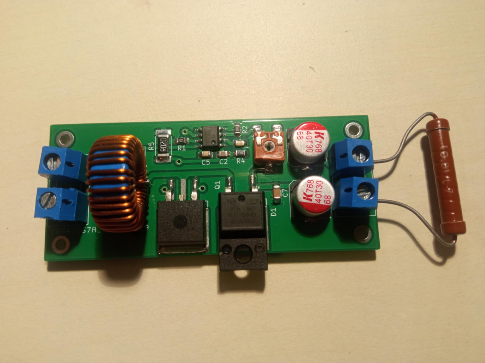

# Boost_Converter
Simple step-up DC/DC converter based on LM3478 controller. Output voltage can be adjusted with a trimmer.
## Converter specification: ##
  - **Input voltage range:** 8-13V
  - **Nominal output voltage:** 20V
  - **Maximal output current:** 1A
  - **Maximal output power:** 20W
  - **Switching frequency:** 200KHz
  - **Voltage ripple:** In progress
  - **Current ripple:** In progress

